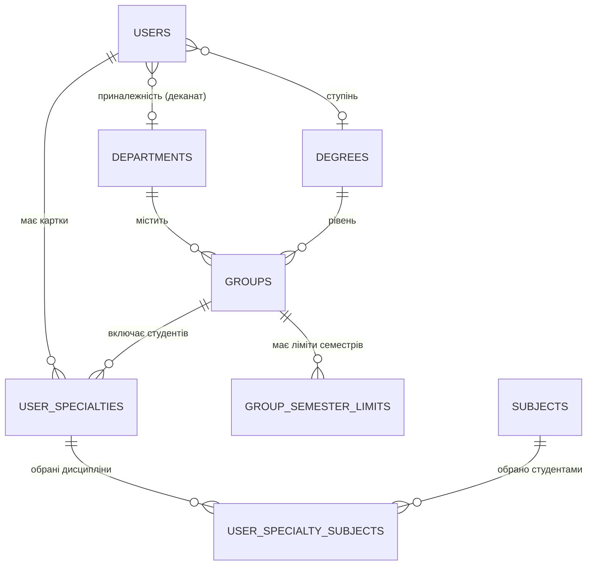

# Технічна документація платформи «E-Cours»
**Дрогобицький державний педагогічний університет імені Івана Франка**

---

## 1. Загальний огляд системи

Платформа **E-Cours** призначена для повної автоматизації процесу формування та вибору вибіркових навчальних дисциплін студентами університету, обліку вибору деканатами та формування аналітичної звітності.

### 1.1. Архітектурний стек
* **Мова програмування**: PHP 8.2+
* **Фреймворк**: Laravel 12.x
* **Адміністративний інтерфейс**: Orchid Platform 14.x (компонентно-екранна архітектура: Screen / Layout / TD)
* **СУБД**: MySQL 8.0+ / MariaDB 10.4+
* **Автентифікація**: Google OAuth 2.0 (Laravel Socialite)
* **Зовнішні API**: Google Sheets API v4 (`google/apiclient`)
* **Генерація звітів**: PhpSpreadsheet (`phpoffice/phpspreadsheet`)
* **Аудит і логування**: Spatie Activitylog (`spatie/laravel-activitylog`)

---

## 2. Модель даних та структура БД

### 2.1. ER-Діаграма взаємозв'язків



### 2.2. Опис ключових таблиць

#### 1. `users`
Облікові записи користувачів системи (студенти, працівники деканатів, адміністратори).
* `id` — первинний ключ.
* `name`, `email` — дані користувача.
* `provider`, `provider_id` — дані Google OAuth.
* `permissions` — JSON-структура прав доступу Orchid.
* `department_id`, `degree_id` — прив'язка працівника деканату до підрозділу/рівня освіти.

#### 2. `user_specialties`
Картки здобувачів вищої освіти (імпортовані з бази ЄДЕБО через Google Sheets).
* `id` — первинний ключ.
* `user_id` — зовнішній ключ на `users.id` (nullable, прив'язується при авторизації через email).
* `card_id` — унікальний ідентифікатор картки в ЄДЕБО (`string`, unique).
* `department_id`, `degree_id`, `group_id` — зовнішні ключі на факультет, рівень освіти та групу.
* `full_name`, `email`, `birth_date`, `gender`, `citizenship`, `rnokpp` — персональні дані (дати автоматично нормалізуються до формату `YYYY-MM-DD`).
* `document_series`, `document_number`, `issue_date`, `valid_until` — документ, що посвідчує особу.
* `study_status` — статус навчання («Зараховано», «Відраховано», «Змінено фінансування»).
* `study_start`, `study_end` — терміни навчання.
* `specialty`, `specialization`, `education_program` — освітня програма та спеціальність.
* `deleted_at` — підтримка Soft Deletes (при відрахуванні студента).

#### 3. `groups` та `group_semester_limits`
* **`groups`**: назва групи (`name`), `department_id`, `degree_id`, `semester_count` (кількість семестрів).
* **`group_semester_limits`**:
  * `group_id` — зовнішній ключ на `groups.id`.
  * `semester` — номер семестру (1, 2, 3...).
  * `max_subjects` — максимальна кількість вибіркових дисциплін, яку студент групи зобов'язаний обрати на цей семестр.

#### 4. `subjects`
Реєстр навчальних дисциплін.
* `name` — назва навчальної дисципліни.
* `chair` — кафедра, яка викладає дисципліну.
* `credits` — кількість кредитів ECTS.
* `control_type` — форма підсумкового контролю (іспит / залік).
* `education_level` — освітній рівень (Бакалавр, Магістр).
* `active` — прапорець доступності дисципліни для вибору (`1`/`0`).
* `annotation` — URL/посилання на файл анотації (PDF).
* `work_program` — URL/посилання на робочу програму (PDF).

#### 5. `user_specialty_subjects`
Pivot-таблиця фактично обраних дисциплін.
* `user_specialty_id` — зовнішній ключ на `user_specialties.id`.
* `subject_id` — зовнішній ключ на `subjects.id`.
* `semester` — семестр, на який дисципліну обрано.
* `is_student_choice` — `true` (якщо обрав сам студент) або `false` (якщо дисципліну призначив деканат/адміністратор).
* `user_id` — автор дії.

#### 6. `settings`
Глобальні системні налаштування (`key`, `value`).
* `subject_selection_enabled`: `1` — вибір відкритий для студентів; `0` — закритий (редагування доступне лише деканату/адміністрації).

---

## 3. Модулі системи та бізнес-логіка

### 3.1. Автентифікація та авторизація (`AuthController`)
1. Студент натискає «Увійти через Google».
2. Маршрут `/auth/google/redirect` перенаправляє на Google OAuth.
3. У методі `/auth/google/callback`:
   - Перевіряється наявність користувача в таблиці `users` за `email`. Якщо немає — створюється новий користувач із базовою роллю студента.
   - Завантажуються записи з Google Sheet («Студенти») для цього `email`.
   - Створюється або оновлюється запис у `user_specialties`, зв'язуючи його з `user_id`, а також визначаються `department_id`, `degree_id` та `group_id` (якщо група вказана).
   - Записується cookie `user_specialty_id` з ідентифікатором обраної активної спеціальності студента.
   - Фіксується запис у журналі аудиту (`activity()`).

### 3.2. Логіка вибору дисциплін (`SelsubjectListScreen`)
1. **Перевірка стану кампанії**:
   Якщо параметр `subject_selection_enabled == '0'` і користувач не має прав `dekanat` чи `admin`, можливість зміни дисциплін блокується.
2. **Перевірка лімітів групи**:
   - При виборі дисципліни на семестр `$semester` перевіряється поточна кількість обраних дисциплін студента на цей семестр.
   - Порівнюється з лімітом групи: `$userSpecialty->group?->semesterLimits->firstWhere('semester', $semester)?->max_subjects`.
   - Якщо ліміт досягнуто — видається попередження `Toast::warning()`, запис не створюється.
   - Якщо ліміт не перевищено — виконується `UserSpecialtySubject::updateOrCreate(...)`.
3. **Скасування вибору**:
   При передачі `$semester == 0` запис дисципліни видаляється, а дія логується в аудит.

### 3.3. Інтеграція з Google Sheets (`App\Services\GoogleSheet`)
* **Базовий клас `GoogleSheetModel`**:
  - Реалізує роботу з Google Sheets API v4 за допомогою сервісного акаунта (`credentials.json`).
  - Метод `readAssoc()` автоматично співставляє заголовки таблиці з назвами стовпців моделі.
* **`StudentsSheet`**: імпорт реєстру студентів (ЕДЕБО).
* **`SelsubjectSheet`**: імпорт каталогу дисциплін.
* **`ReportSubjectsStudentsSheet` / `ReportStudentsGroupSheet`**: двосторонній експорт сформованих списків у Google Таблиці.

### 3.4. Нормалізація дат (`UserSpecialty::parseDateValue`)
Для уникнення помилок несумісності форматів між Google Sheets (де дати можуть бути `m/d/Y`, `d.m.Y`, `Y-m-d`, `2026-03-09 9:11:0` або `?`), у моделі [UserSpecialty](file:///e:/OSPanel/home/e-cours.loc/app/Models/UserSpecialty.php) реалізовано автоматичні мутатори, які перед записом у БД приводять значення до стандартного `Y-m-d` чи `null`.

---

## 4. REST API та точки інтеграції

### 4.1. Експорт вибору студентів
* **URL**: `GET /api/students-subjects`
* **Контролер**: `App\Http\Controllers\Api\StudentSubjectController@index`
* **Параметри запиту**:
  * `only_chosen` (`boolean`, опціонально) — фільтрація тільки дисциплін, обраних особисто студентом (`is_student_choice = true`).
  * `export` (`string`, опціонально) — якщо передано `csv`, відповідь віддається у вигляді потокового завантаження файлу CSV (з UTF-8 BOM для коректного відкриття в Excel).
  * `per_page` (`integer`, за замовчуванням 100) — кількість записів на сторінку для JSON-відповіді.
* **Приклад відповіді JSON**:
```json
{
  "success": true,
  "data": {
    "current_page": 1,
    "data": [
      {
        "edebo": "13630258",
        "student_name": "Баранецький Василь Олегович",
        "component": "Інноваційні технології в освіті",
        "semester": 1,
        "component_volume": 4
      }
    ],
    "total": 1250
  }
}
```

### 4.2. Експорт відомості групи в Excel
* **URL**: `GET /export/group/{group}/excel`
* **Контролер**: `App\Http\Controllers\GroupExportController@exportExcel`
* **Middleware**: `auth`
* **Опис**: Формує та віддає на завантаження файл `.xlsx` з матрицею вибору дисциплін по кожному студенту групи та підсумковими сумами по семестрах.

---

## 5. Безпека та рольова модель (RBAC)

У системі використовуються вбудовані можливості Orchid Platform Permissions:

| Роль / Права | Опис дозволених дій |
|---|---|
| **Студент** (`platform.index`) | Перегляд каталогу дисциплін свого рівня освіти, вибір/скасування предметів для своєї картки у відкритий період. |
| **Деканат** (`dekanat`) | Перегляд списків студентів та груп свого факультету, вибір дисциплін за студентів, завантаження звітів групи. |
| **Адміністратор** (`platform.systems.roles`, `platform.systems.users`) | Повний доступ до конфігурацій, управління користувачами, ролями, семестровими лімітами груп, імпорту/експорту Google Sheets, журналам дій. |

---

## 6. Журнал аудиту (Activity Log)

Кожна ключова операція в системі фіксується в таблиці `activity_log` із зазначенням:
* Хто виконав дію (`causer_id`, `causer_type`).
* Опис події (наприклад, *«Дисципліна обрана студентом Іваненко І.І.: Назва дисципліни (Спеціальність)»* або *«Дисципліна призначена адміністратором за студента...»*).
* Властивості (properties) у форматі JSON: назва дисципліни, спеціальність, статус `is_student_choice`.
* Перегляд логів доступний в адмін-панелі за адресою `/platform/activity/logs`.
